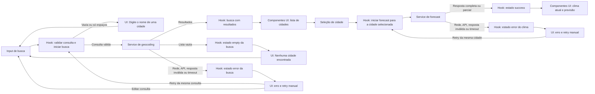

# Weather App — Plano Técnico

Este plano deriva de [`specs/weather-app-spec.md`](../specs/weather-app-spec.md), que permanece como fonte da verdade para o comportamento e os critérios de aceite. As metas marcadas como baseline proposta continuam sujeitas à aprovação indicada na especificação.

## Architecture

- Aplicação cliente de página única com Vite e React; não há servidor próprio, autenticação, banco de dados nem camada de persistência.
- `App.tsx` compõe o fluxo: chama `useWeatherApp` e conecta estado e ações às propriedades dos componentes.
- `components` renderiza interface e emite intenções por callbacks; não faz requisições nem contém regras de negócio. `hooks` orquestra busca, seleção, unidade, loading, erros, retry e concorrência.
- `services` concentra chamadas HTTP, parâmetros, timeout e tradução de falhas de transporte. `lib` mantém funções puras para validar/mapear respostas externas e formatar datas, condições e temperaturas; não importa React nem acessa rede ou estado global.
- Direção das dependências: `App → hooks → services → lib` e `App → components → lib` (somente formatadores puros). Tipos de domínio em `types` podem ser importados pelas camadas sem criar dependência circular.
- O adaptador transforma respostas externas em tipos de domínio; componentes não conhecem o formato JSON do provedor.
- Usar o endpoint de previsão para buscar, em uma única chamada por cidade selecionada, condições atuais e dados diários. Isso reduz latência e mantém as duas visualizações coerentes; a normalização permite dados parciais por campo ou seção.
- A busca de cidades e a consulta meteorológica são operações independentes. Selecionar uma cidade inicia a consulta meteorológica com seu identificador e coordenadas, nunca com dados de outro resultado.
- Manter os dados apenas em memória durante a sessão. Não adicionar backend, cache próprio, armazenamento local, telemetria ou atualização periódica nesta versão.
- Aplicar prazo máximo de 8 segundos por requisição, cancelamento de solicitações substituídas e proteção por identificador de requisição. Uma resposta antiga não pode atualizar a interface depois de uma consulta mais recente.

## Tech Stack

| Camada | Decisão |
|---|---|
| Linguagem e aplicação | TypeScript em modo strict, React 19 e Vite, conforme a base existente. |
| Estilo | Tailwind CSS existente; responsividade de 320 px a 1440 px e atendimento aos requisitos de contraste e foco da spec. |
| Rede | `fetch`, `URL`/`URLSearchParams` e `AbortController` nativos. Não introduzir cliente HTTP sem necessidade comprovada. |
| Datas e localização | `Intl.DateTimeFormat` com locale `pt-BR` e fuso IANA recebido do provedor. Não adicionar biblioteca de datas na V1. |
| Estado | `useReducer` e hooks React; sem biblioteca externa de estado. |
| Qualidade | Biome para lint/check, Vitest e Testing Library para testes de unidade e interface, Playwright para E2E. |

Temperaturas da API serão solicitadas em Celsius e velocidades do vento em km/h. Fahrenheit é uma transformação de apresentação a partir do valor Celsius de origem; converter repetidamente o valor já arredondado é proibido. A unidade começa em Celsius e dura somente enquanto a aplicação está aberta.

## Project Structure

Estrutura-alvo para a implementação. O repositório ainda não possui `src/` nem arquivos de aplicação; esta árvore orienta as próximas tarefas sem exigir módulos adicionais antes de serem necessários.

```text
src/
  App.tsx
  main.tsx
  components/
    CitySearch.tsx
    CityResults.tsx
    CurrentConditions.tsx
    FiveDayForecast.tsx
    TemperatureUnitControl.tsx
    RequestStatus.tsx
  hooks/
    useWeatherApp.ts
  services/
    openMeteoService.ts
  lib/
    openMeteoMapper.ts
    temperature.ts
    weatherFormat.ts
  types/
    weather.ts
  index.css
tests/
  unit/
    components/CitySearch.test.tsx
    hooks/useWeatherApp.test.tsx
    lib/openMeteoMapper.test.ts
    lib/temperature.test.ts
    lib/weatherFormat.test.ts
    services/openMeteoService.test.ts
  integration/
    weatherApp.test.tsx
  e2e/
    weather-flow.spec.ts
  fixtures/
    openMeteo.ts
```

  `components` recebe dados e callbacks tipados e pode usar formatadores puros de `lib`; não acessa serviços nem estado global. `hooks` coordena as operações usando o contrato `WeatherGateway`; `services` adapta HTTP a esse contrato; `lib` valida e transforma valores sem efeitos colaterais. Essa fronteira permite testar componentes com props, hooks com um gateway falso, serviços com `fetch` controlado e funções de `lib` diretamente, sem API real. Manter componentes focados nos fluxos da spec; não criar camadas de repositório, cache, cliente genérico ou abstrações adicionais sem necessidade observada.

## Data Model

O adaptador normaliza os dados externos antes que alcancem a interface. Campos numéricos opcionais usam `null` para indisponível; zero continua sendo um valor válido.

```ts
export type Unit = 'celsius' | 'fahrenheit';
export type NullableNumber = number | null;

export interface City {
  id: string;
  name: string;
  admin1: string | null;
  country: string;
  latitude: number;
  longitude: number;
}

export interface CurrentWeather {
  observedAt: string | null;
  weatherCode: number | null;
  temperatureC: NullableNumber;
  apparentTemperatureC: NullableNumber;
  humidityPercent: NullableNumber;
  windSpeedKmh: NullableNumber;
}

export interface ForecastDay {
  date: string;
  weatherCode: number | null;
  minTemperatureC: NullableNumber;
  maxTemperatureC: NullableNumber;
  maxPrecipitationProbabilityPercent: NullableNumber;
}

export interface WeatherData {
  timezone: string;
  current: CurrentWeather;
  forecast: ForecastDay[];
  completeness: 'complete' | 'partial';
}

export type ServiceErrorKind =
  | 'timeout'
  | 'network'
  | 'http'
  | 'invalid-response';

export interface WeatherGateway {
  searchCities(query: string, signal: AbortSignal): Promise<City[]>;
  getWeather(city: City, signal: AbortSignal): Promise<WeatherData>;
}
```

Invariantes do modelo:

- `City.id` deriva do identificador de geocoding; coordenadas são finitas e pertencem exatamente à cidade selecionada.
- `WeatherData.timezone` é o fuso IANA retornado para as coordenadas. Ausência ou valor inválido impede formatar datas corretamente e torna a resposta inválida.
- `forecast` contém cinco posições consecutivas, começando na data local de hoje retornada pelo provedor. Uma posição ou campo ausente é preservado como indisponível, sem preenchimento com zero ou dado anterior.
- `weatherCode` é o código WMO de origem. A camada de apresentação mapeia códigos conhecidos para condições em pt-BR; código desconhecido é indisponível, não um rótulo inventado.
- `completeness` indica se todos os campos e dias esperados foram normalizados. Uma resposta parcial ainda pode ser exibida com os valores ausentes identificados como “Indisponível”.

Contrato de estado da aplicação:

```ts
export type SearchState =
  | { status: 'idle' }
  | { status: 'loading'; requestId: number; query: string }
  | { status: 'success'; results: City[] }
  | { status: 'empty' }
  | { status: 'error'; kind: ServiceErrorKind; query: string };

export type WeatherState =
  | { status: 'idle' }
  | { status: 'loading'; requestId: number; cityId: string }
  | { status: 'success'; cityId: string; report: WeatherData }
  | { status: 'error'; kind: ServiceErrorKind; city: City };

export interface WeatherAppState {
  query: string;
  search: SearchState;
  selectedCity: City | null;
  weather: WeatherState;
  temperatureUnit: Unit;
}
```

Contratos de apresentação puros: `formatTemperature(valueC, unit)` converte do valor Celsius original e arredonda uma vez a uma casa decimal; `formatObservedAt(isoTime, timezone)` e `formatDate(isoDate, timezone)` usam `pt-BR`; `getWeatherConditionLabel(code)` retorna condição localizada ou “Indisponível”.

## Data Flow



1. A pessoa digita a cidade. No envio por botão ou Enter, normalizar apenas removendo espaços periféricos; consulta vazia não chama o serviço e mostra a validação definida na spec.
2. O hook inicia a busca com novo `requestId` e `AbortController`. `URLSearchParams` codifica a consulta sem remover acentos, hífens, apóstrofos ou espaços internos.
3. O serviço normaliza cada resultado para `City`. Zero resultados produzem estado vazio; seleção usa o `City` correspondente ao item acionado.
4. Ao selecionar, atualizar `selectedCity`, limpar os dados meteorológicos da cidade anterior e solicitar o relatório usando o identificador/latitude/longitude selecionados.
5. O serviço converte o JSON do endpoint em `WeatherData`, validando raiz, fuso, datas e valores finitos sem descartar campos válidos por causa de outros ausentes.
6. O reducer aceita sucesso ou falha somente quando `requestId` e `cityId` ainda correspondem à operação ativa. Respostas antigas e abortadas são ignoradas.
7. A interface renderiza condição, horário e previsão localizada. Alternar unidade atualiza a apresentação de todos os valores Celsius em memória sem nova chamada meteorológica.
8. Em falha, encerrar loading e guardar os parâmetros da última operação; o retry explícito repete somente essa operação, sem retry automático.

## External APIs

Base escolhida pela spec: Open-Meteo, sem API key. A integração permanece condicionada à validação de cobertura, CORS, termos, atribuição e limites de uso para produção.

### Geocoding

- **URL:** `https://geocoding-api.open-meteo.com/v1/search`
- **Parâmetros:** `name` recebe a consulta já aparada; `count=10` limita a lista da V1 (decisão técnica proposta, sem autocomplete); `language=pt` solicita nomes em português; `format=json` seleciona JSON.
- **Exemplo de chamada:** `https://geocoding-api.open-meteo.com/v1/search?name=S%C3%A3o+Paulo&count=10&language=pt&format=json`
- **Resposta resumida:**

```json
{
  "results": [
    {
      "id": 3448433,
      "name": "São Paulo",
      "latitude": -23.5505,
      "longitude": -46.6333,
      "admin1": "São Paulo",
      "country": "Brasil",
      "country_code": "BR"
    }
  ]
}
```

Mapeamento de cada item de `results` para `City`: `id` é convertido para `string`; `name`, `admin1`, `country`, `latitude` e `longitude` são copiados. Se `admin1` não vier, normalizar para `null`; não inferir o valor. Uma resposta válida sem resultados vira lista vazia.

### Forecast

- **URL:** `https://api.open-meteo.com/v1/forecast`
- **Parâmetros:** `latitude` e `longitude` vêm da `City` selecionada; `current=temperature_2m,apparent_temperature,relative_humidity_2m,weather_code,wind_speed_10m`; `daily=weather_code,temperature_2m_max,temperature_2m_min,precipitation_probability_max`; `timezone=auto`; `forecast_days=5`; `temperature_unit=celsius`; `wind_speed_unit=kmh`.
- `current` solicita observação, temperatura, sensação térmica, umidade, condição WMO e vento para o clima atual. `daily` solicita condição WMO, mínima, máxima e probabilidade máxima de precipitação. `timezone=auto` retorna o fuso da cidade pelas coordenadas; `daily.time` usa as datas locais nesse fuso.
- **Exemplo de chamada:** `https://api.open-meteo.com/v1/forecast?latitude=-23.5505&longitude=-46.6333&current=temperature_2m%2Capparent_temperature%2Crelative_humidity_2m%2Cweather_code%2Cwind_speed_10m&daily=weather_code%2Ctemperature_2m_max%2Ctemperature_2m_min%2Cprecipitation_probability_max&temperature_unit=celsius&wind_speed_unit=kmh&timezone=auto&forecast_days=5`
- **Resposta resumida** (valores ilustrativos; as posições dos arrays correspondem à mesma data):

```json
{
  "timezone": "America/Sao_Paulo",
  "current": {
    "time": "2026-09-30T12:15",
    "temperature_2m": 22.4,
    "apparent_temperature": 22.1,
    "relative_humidity_2m": 61,
    "weather_code": 2,
    "wind_speed_10m": 9.4
  },
  "daily": {
    "time": ["2026-09-30", "2026-10-01", "2026-10-02", "2026-10-03", "2026-10-04"],
    "weather_code": [2, 3, 61, 3, 1],
    "temperature_2m_min": [16.2, 17.0, 18.1, 17.5, 16.8],
    "temperature_2m_max": [24.8, 25.1, 22.6, 23.4, 24.0],
    "precipitation_probability_max": [10, 20, 80, 30, 5]
  }
}
```

Mapeamento para o modelo:

| Resposta Open-Meteo | Campo de domínio | Regra |
|---|---|---|
| Item de geocoding `results[]` | `City` | Mapear campos como descrito acima; converter o ID numérico para string. |
| `timezone` | `WeatherData.timezone` | Preservar o identificador IANA retornado. |
| `current.time` | `WeatherData.current.observedAt` | Preservar o timestamp local recebido; formatar com `WeatherData.timezone`. |
| `current.weather_code` | `WeatherData.current.weatherCode` | Preservar código WMO; a apresentação traduz códigos conhecidos para pt-BR. |
| `current.temperature_2m` | `WeatherData.current.temperatureC` | Celsius devido a `temperature_unit=celsius`. |
| `current.apparent_temperature` | `WeatherData.current.apparentTemperatureC` | Celsius; corresponde à sensação térmica. |
| `current.relative_humidity_2m` | `WeatherData.current.humidityPercent` | Percentual de umidade relativa. |
| `current.wind_speed_10m` | `WeatherData.current.windSpeedKmh` | km/h devido a `wind_speed_unit=kmh`. |
| `daily.time[i]` | `WeatherData.forecast[i].date` | Preservar data local ISO (`YYYY-MM-DD`); alinhar todos os arrays pelo mesmo índice `i`. |
| `daily.weather_code[i]` | `WeatherData.forecast[i].weatherCode` | Código WMO do dia. |
| `daily.temperature_2m_min[i]` / `daily.temperature_2m_max[i]` | `WeatherData.forecast[i].minTemperatureC` / `maxTemperatureC` | Celsius; converter somente para apresentação em Fahrenheit. |
| `daily.precipitation_probability_max[i]` | `WeatherData.forecast[i].maxPrecipitationProbabilityPercent` | Percentual entre 0 e 100. |

`WeatherData.forecast` deve conter cinco dias locais consecutivos. Valores ausentes, não finitos ou inválidos são normalizados para `null`, sem substituir zero válido; `completeness` será `partial` se faltarem campos/dias esperados. A preferência `Unit` (`celsius` ou `fahrenheit`) não vem desta API: começa em Celsius e é mantida apenas no estado da sessão.

Regras de integração:

- Criar URLs com `URL` e `URLSearchParams`; nunca concatenar texto de busca diretamente como parte da URL.
- Verificar `response.ok`, JSON e formato esperado. Campos escalares devem ser finitos e percentuais permanecer no intervalo de 0 a 100; valores inválidos viram indisponíveis. Resposta inválida na raiz é falha, não resposta vazia.
- Usar `AbortController` por chamada, prazo de 8 segundos e limpeza do timer ao concluir. Não implementar repetição automática.
- Não armazenar respostas em cache próprio. Exibir `current.time` recebido; não alegar frescor superior ao horário informado pelo provedor.

## State Management

- O estado da aplicação vive em memória no hook `useWeatherApp`, em um `useReducer`: consulta digitada, resultados/estado da busca, cidade selecionada, estado/dados meteorológicos e `Unit`. Não usar Context global nem biblioteca de estado: o fluxo pertence a uma tela.
- Busca e clima têm máquinas de estado independentes. Busca: `idle` (ainda não enviada), `loading`, `success` (resultados), `empty` (resposta válida sem cidades) e `error`. Clima: `idle` (nenhuma cidade selecionada), `loading`, `success` e `error`; `empty` é específico de busca. Uma resposta meteorológica utilizável, porém incompleta, é `success` com `WeatherData.completeness: 'partial'`.
- `idle` é o estado inicial; iniciar uma operação passa somente seu fluxo para `loading`; resposta válida passa a `success` ou `empty` para busca; falha recuperável passa a `error`; retry manual volta a `loading`. Concluir uma busca não apaga o clima já selecionado. Selecionar outra cidade limpa imediatamente o relatório anterior e inicia o fluxo de clima.
- `requestId` integra o estado serializável do reducer. `AbortController` e contadores de requisição ficam em refs do hook; o reducer ignora ações com identificador obsoleto. Serviços não leem nem alteram estado React.
- `WeatherData` mantém todas as temperaturas em Celsius, sem incluir a preferência `Unit`. A unidade começa em `celsius`; alterná-la atualiza apenas `temperatureUnit` no reducer. Na renderização, um formatador puro deriva cada valor a partir do Celsius original: Celsius mantém $C$; Fahrenheit calcula $F = (C \times 9/5) + 32$; arredondar o resultado a uma casa decimal. Não arredondar a origem, mutar o relatório nem fazer novo request. Aplicar a clima atual, sensação térmica e máximas/mínimas; não aplicar a umidade, ao vento ou à precipitação.
- Valores numéricos `null` continuam indisponíveis independentemente da unidade e aparecem como “Indisponível”; zero é convertido e exibido normalmente.
- Não persistir unidade, consulta, cidade ou histórico em `localStorage`, `sessionStorage`, cookies ou servidor.
- Nova busca invalida uma busca pendente anterior. Selecionar nova cidade invalida a consulta meteorológica anterior. Retry reutiliza os parâmetros da operação com falha; editar a busca não altera silenciosamente um retry já disponível.

## Error Handling

| Tipo/condição | Classificação e tratamento |
|---|---|
| Consulta vazia ou só com espaços | Validação local; não requisitar. Manter a busca editável e exibir “Digite o nome de uma cidade.”. |
| Geocoding responde corretamente sem cidades | `search.status = 'empty'`; exibir “Nenhuma cidade encontrada.”, encerrar loading e permitir editar e reenviar. Não iniciar forecast. |
| Falha de rede (offline, DNS ou conexão recusada) | Erro recuperável `network`; encerrar loading, exibir “Não foi possível carregar os dados. Tente novamente.” e oferecer retry manual. |
| Open-Meteo responde com HTTP não-2xx | Erro recuperável `http`; registrar a categoria para diagnóstico local, mas não expor detalhes do provedor. Usar a mensagem genérica e retry manual. |
| JSON inválido, raiz incompatível ou fuso ausente/inválido | `invalid-response`; não tratar como lista vazia nem apresentar como dados válidos. Encerrar loading, mensagem genérica e retry manual. |
| Requisição passa de 8 segundos | Abortar com `AbortController`, classificar como `timeout`, encerrar loading e oferecer retry manual. Diferenciar timeout de abort por substituição/cancelamento; não repetir automaticamente. |
| Resposta parcial com conteúdo aproveitável | `success` com `completeness: 'partial'`; preservar os campos/dias válidos e mapear ausentes ou valores não finitos para `null`/“Indisponível”. Zero permanece válido; não reutilizar dados antigos. |
| Resposta meteorológica sem qualquer campo ou dia utilizável | `invalid-response` recuperável, não sucesso vazio; manter retry disponível. Uma resposta parcial só é utilizável se o fuso for válido e existir pelo menos um valor meteorológico válido em `current` ou em um dia datado. |
| Código WMO desconhecido ou valor individual fora do domínio esperado | Marcar apenas o campo afetado como indisponível e preservar os demais dados válidos. |
| Resultado de requisição obsoleta | Ignorar por `requestId`/cidade selecionada; não alterar estados, dados nem mensagens do fluxo mais recente. |

Erros e atualizações relevantes devem ser anunciados por tecnologia assistiva; foco visível e retry por teclado fazem parte do fluxo. Todo texto exposto, inclusive rótulos acessíveis e erros, é pt-BR. Para NFR-04, só contar como consulta bem-sucedida dados suficientes para renderizar clima atual e previsão; uma resposta parcial pode ser apresentada sem ser contada como sucesso operacional completo.

## Testing Strategy

- **Vitest — funções puras (`lib`):** testar Celsius/Fahrenheit, ida e volta sem usar valor arredondado como origem, arredondamento a uma casa, `null`, zero e negativos; testar formatação `pt-BR` com fuso IANA, códigos WMO conhecidos/desconhecidos e normalização de respostas completas, parciais e inválidas. Usar casos tabulares e relógio controlado, sem rede ou React.
- **Vitest — serviços:** mockar `fetch` para validar URLs/parâmetros e mapeamento dos JSONs de fixture; cobrir falha de rede, HTTP não-2xx, JSON inválido, campos omitidos, timeout em 8 segundos, cancelamento e ausência de retry automático. Nenhum teste unitário chama Open-Meteo.
- **Vitest — componentes:** com Testing Library, verificar estados de busca `loading`, `error`, `empty` e `success` (resultados), e estados meteorológicos `loading`, `error`, `success` completo e `success` parcial. Acionar Enter, botões e controles por teclado; verificar roles, nomes acessíveis, mensagem “Indisponível” e callbacks sem montar serviços reais.
- **Vitest — hook/orquestração:** usar `WeatherGateway` falso e respostas deferred para testar transições de estado, busca vazia sem requisição, selecionar o resultado correto, retry manual, alternância de unidade sem chamada meteorológica extra e descarte de resposta obsoleta. Manter estes testes focados no contrato do hook, não repetir todos os fluxos E2E.
- **Playwright — fluxos E2E:** interceptar geocoding e forecast com fixtures determinísticas. Cobrir busca por botão/Enter, input vazio, caracteres acentuados, homônimos e seleção, clima atual, cinco dias, conversão C→F→C sem nova chamada, nenhum resultado, falhas de rede/API, timeout, retry manual, resposta parcial e acessibilidade básica por teclado. Não depender da disponibilidade do provedor.
- **Playwright — viewport mobile/responsividade:** a configuração existente tem Chromium desktop e projeto iPhone 13; usar o projeto mobile em 390 x 844 px e um teste parametrizado de viewport nos tamanhos 320, 390, 768, 1024 e 1440 px definidos em NFR-01. Verificar rolagem horizontal, sobreposição e conclusão dos fluxos principais. O restante da matriz de navegadores NFR-06 deve ser habilitado/validado antes do release; ela não está toda representada nos projetos atuais.
- **Acessibilidade e performance:** complementar os E2E com validação de WCAG 2.2 AA, leitor de tela e contraste. Medir p95 em 100 execuções a 390 x 844 px e perfil 4G conforme NFR-03, separando duração do provedor e da aplicação no harness de teste.
- **Gate operacional:** a meta mensal de 99,5% exige medição aprovada além dos testes de cliente. Não introduzir coleta ou serviço de monitoramento que inclua consultas/localização sem aprovação de privacidade.

## Risks & Trade-offs

### Decisões técnicas e alternativas

| Decisão | Alternativa considerada | Trade-off |
|---|---|---|
| `useReducer` local em `useWeatherApp` | Vários `useState` distribuídos ou estado global com Redux/Zustand | O reducer mantém transições assíncronas explícitas e testáveis. Estado global seria justificável com várias telas/consumidores, mas adicionaria dependência e complexidade à V1. |
| `fetch` e `AbortController` nativos | Axios ou React Query | Evita dependências e políticas implícitas de cache/retry incompatíveis com a spec. Axios/React Query oferecem conveniências úteis se surgirem consultas compartilhadas, cache aprovado ou mais fluxos. |
| Um endpoint forecast para `current` e `daily` | Chamadas separadas para clima atual e previsão | Uma chamada reduz latência e sincronização; uma falha HTTP afeta os dois blocos. Separar permitiria falhas e retries independentes, ao custo de tráfego e mais estados. |
| Celsius como dado de origem e conversão na renderização | Solicitar novamente à API ao alternar a unidade | A troca é instantânea, uniforme e não gera request; exige conversões puras e testes que garantam que todos os campos usam o valor original. |
| `Intl.DateTimeFormat` nativo | Biblioteca dedicada de datas e fusos | Evita dependência para a formatação limitada da V1; uma biblioteca poderia simplificar cálculos de calendário mais avançados, ainda fora do escopo. |
| Fixtures e `fetch`/rotas mockados nos testes | Depender da Open-Meteo em cada teste | Mocking torna CI determinístico e independente de rede/quota, mas não detecta sozinho mudanças reais do provedor; complementar com validação do contrato e smoke test controlado antes do release. |
| SPA chama Open-Meteo diretamente | Backend/BFF como proxy | Mantém a arquitetura simples porque a API não exige chave secreta; um BFF permitiria controlar quotas, cache e observabilidade, mas adicionaria operação, custo e responsabilidades de privacidade. |

### Riscos residuais

| Risco ou trade-off | Decisão/mitigação |
|---|---|
| Termos, cobertura, atribuição, CORS, limites ou disponibilidade do Open-Meteo podem não atender produção. | Validar com o provedor antes do lançamento; NFR-04 é gate, não garantia desta arquitetura cliente. |
| A aplicação não controla nem consegue medir por si só uma meta mensal end-to-end de 99,5%. | Definir uma estratégia operacional aprovada antes de declarar a meta atendida; não acrescentar backend ou telemetria sem decisão explícita. |
| Uma chamada meteorológica conjunta simplifica latência e coerência, mas uma falha HTTP afeta clima atual e previsão juntos. | Exibir erro recuperável; aproveitar resposta parcial somente quando o corpo for utilizável. Reavaliar chamadas separadas apenas se o contrato do provedor exigir disponibilidade independente. |
| Dados meteorológicos parciais ou código WMO futuro/desconhecido podem deixar campos sem valor. | Modelo nullable, código desconhecido indisponível e testes de fixtures parciais; não inventar condição ou dado. |
| Cálculo de datas no fuso do dispositivo pode errar em virada de dia ou horário de verão. | Usar o fuso retornado pelo endpoint e as datas locais `daily.time`; não inferir o dia local via timezone do browser. |
| Frescor aceitável e atualização automática não foram decididos na spec. | Não fazer polling na V1; apresentar horário retornado e manter essa decisão como pendente de aprovação do produto. |
| Público prioritário e metas de usabilidade permanecem hipóteses. | Tratar NFR-07 como critério de validação, não como evidência já obtida; confirmar participantes com produto. |
| Sem persistência, a preferência Fahrenheit se perde ao fechar/recarregar a página. | Comportamento intencional de acordo com NFR-08; não persistir sem nova decisão de produto. |
